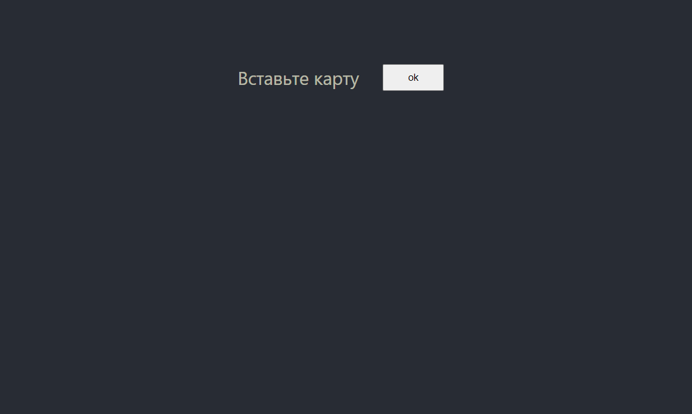

<h1 align="center">Atm operations</h1>

<h1 align="center">

[](https://ci.appveyor.com/project/VladimirOlishevsky/atm-test)

</h1>



<h1 align="center"><a href="https://github.com/VladimirOlishevsky/atm-test.git">Live Demo</a></h1>

## Description

The ATM has a cassette for banknotes. Banknote denominations: 100, 200, 500, 1000, 2000 and 5000 rubles. There is also a customer who is served by an ATM. The client has a wallet. The client's wallet contains banknotes of the same denomination as in the ATM.

## Working with the project:
- The ATM screen displays “Insert card”.
- The user inserts the card. (press ```OK```).
- Enters the pin code. (default pincode ```0000```)
- If the PIN code is incorrect, the ATM asks to repeat the PIN code.
- If the PIN is correct, the customer card is displayed on the screen. The card has a total amount and a button to end the session.

```Cash withdrawal operation```:
- A field is displayed where the user sets the amount. After logging in, the customer clicks a button to receive cash.
- If there is no available amount in the ATM, or the ATM cannot dispense such an amount due to the lack of banknotes of the required denomination, or the amount on the card is less than the requested amount, the message “The operation cannot be performed. to be fulfilled. to be executed. “It is proposed to enter a different amount or return the card.
- If the requested amount meets the conditions, the ATM dispenses money. The money is debited from the ATM and credited to the user's wallet in accordance with the issued denominations of bills.

```Cash deposit operation```.
- The client puts banknotes of the corresponding denominations into the ATM.
- Presses the confirmation button.
- Money is debited from the wallet, replenishing the ATM cassette.

```Extra buttons```
- When you click on the ```Write off from all``` button, money is also debited from the card at the ATM.
- When you click the ```Add to all``` button, they are credited to the card and ATM.

## Where to begin:
- Clone the repository https://github.com/VladimirOlishevsky/atm-test
- Set ```yarn``` dependencies
- Start a ```yarn start``` project.
- Enjoy it :)

